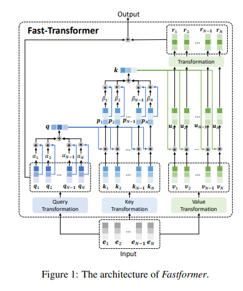

## 标题
Paddle implementation of 

[Fastformer: Additive Attention is All You Need](https://arxiv.org/abs/2108.09084)

## 简介
使用 Fastformer 结构做情感主题分类

Amazon Electronic Product Review Rating Classification

文本分类任务， 5 分类

## 内容

### 网络结构

</img>

### 实验设置

- 第一列，Amazon

### 评价指标

- MacroF

### 数据集
使用 Amazon Product Data 并随机抽取 [Electronics](https://aistudio.baidu.com/aistudio/datasetdetail/114776) 子类中 45k 的数据集

- 40k train
- 5k eval

### 初始权重

- [initial_params for Paddle](https://aistudio.baidu.com/aistudio/datasetdetail/114900)

### AI Studio 项目链接

https://aistudio.baidu.com/aistudio/projectdetail/2559430?shared=1

## Github Repo
check with torch

- https://github.com/rainyBJ/fast-transformer-paddle

## 参考 Repo

- https://github.com/wilile26811249/Fastformer-PyTorch

- https://github.com/wuch15/Fastformer